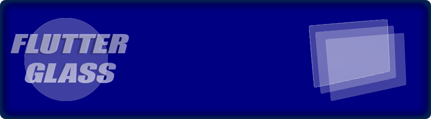

# Flutter Glass plugin

A flutter package that adds the possibility of making glass containers to your app.


### Installation

To use this plugin, add flutter_glass in your `pubspec.yaml`

```
dependencies:
flutter_glass: ^0.0.1
```

Or install automatically using this command

```
$ flutter pub add flutter_glass`
```

### License

This SDK is available under the MIT license.
